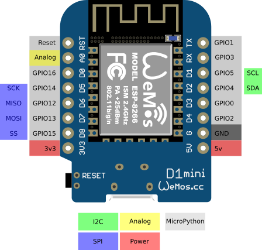

# About ESP8266

The ESP8266 is a low cost WiFi enabled microcontroller produced by manufacturer Espressif Systems in Shanghai, China. Originally intended as a WiFi module, the low cost lead hackers to explore the chips usage as a microcontroller in it's own right.

 

## Specification

|  |  |
| --- | --- |
| Processor | 32-bit RISC microprocessor running at 80MHz |
| Memory | 32 KiB instruction, 80 KiB user data |
| External Flash | up to 16 MiB supported (512 KiB to 4MiB typically included) |
| Networking | IEEE 802.11 b/g/n Wi-Fi |
| I/O | 16 GPIO pins  SPI  I2C  I2S  UART  10-bit ADC |

 

## Development Boards

There are many different ESP8266 based development boards available with the chip I/O broken out to breadboard friendly pins.

 

### Pinouts

Node MCU Pinout

Wemos D1 mini Pinout

More details about the different output pins on an ESP8266 can be found here: https://randomnerdtutorials.com/esp8266-pinout-reference-gpios/

 

## Arduino Setup

The ESP8266 can be programmed through the Arduino IDE, in much the same way that an Arduino Uno might be programmed.

1. To use the ESP8266 with the Arduino IDE, first the board manager files for the ESP8266 need to be installed. To install these files, follow the instructions here: https://arduino-esp8266.readthedocs.io/en/latest/installing.html#instructions

2. Select your ESP8266 board and COM port under board configuration (Tools -> Board menu.)

 

## Micropython Setup

[##TODO]

 

## AT Commands

When using the ESP8266 as a WiFi module, it can be programmed using AT commands.

[##TODO]

 

## Troubleshooting

 

## References

* https://www.espressif.com/en/products/hardware/esp8266ex/overview
* https://randomnerdtutorials.com/esp8266-pinout-reference-gpios/
